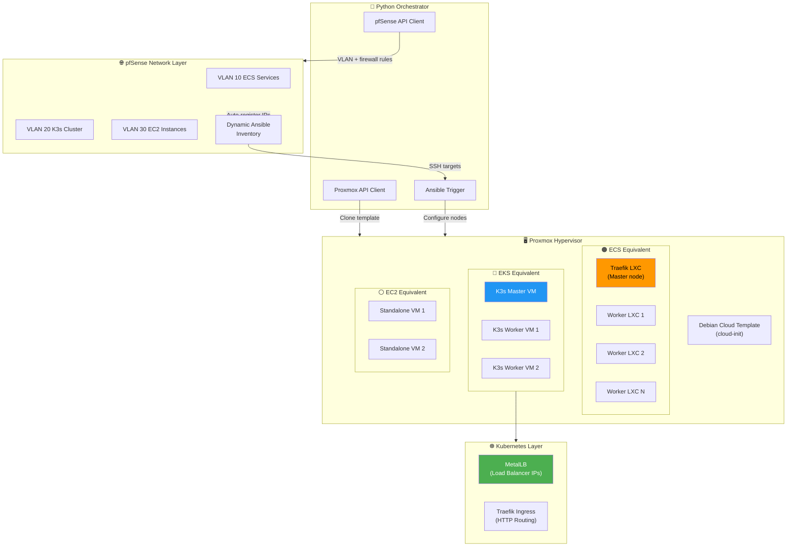
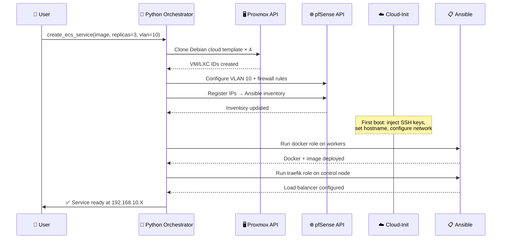

# 🏗️ HomeLab Private Cloud Platform

> A fully automated private cloud platform built on Proxmox and pfSense, replicating core AWS/OCI services — ECS, EKS, and EC2 — using Python, Ansible, and cloud-init. Single-command provisioning with VLAN-based network isolation.

---

## 🎯 Project Overview

**For Everyone:**
This project is like building your own AWS from scratch. Instead of clicking "Launch Instance" on AWS and paying for cloud services, everything runs on bare metal at home — but with the same automation, isolation, and orchestration patterns that real cloud providers use internally.

**For Technical Users:**
A bare-metal private cloud platform that automates the full lifecycle of virtual machines, LXC containers, and Kubernetes clusters using the Proxmox hypervisor and pfSense for network management. The Python orchestrator ties together the Proxmox API, pfSense API, and Ansible to deliver a one-command provisioning experience with dynamic inventory management, VLAN-based tenant isolation, and three cloud-equivalent services.

---

## 🏛️ Architecture Overview



---

## ☁️ Services

### 🟠 ECS Equivalent — Containerized Workloads

Replicates **AWS ECS** behavior — deploy any Docker image with N replicas behind an automatic load balancer.

```
User specifies:
  - Docker image (public or private)
  - Credentials (if private registry)
  - Number of replicas

Platform delivers:
  - N LXC worker containers running the image
  - 1 Traefik LXC as load balancer
  - VLAN-isolated network
  - Zero manual steps
```

**AWS Equivalent Mapping:**

| ECS Concept | This Project |
|-------------|-------------|
| ECS Cluster | Group of LXC containers per VLAN |
| Task Definition | Docker Compose template |
| ECS Service | `restart: always` + healthcheck |
| ALB | Traefik LXC auto-discovery |
| VPC Subnet | VLAN per service |
| ECR credentials | Ansible Vault secret injection |

---

### 🔵 EKS Equivalent — Kubernetes Orchestration

Replicates **AWS EKS** behavior — automated Kubernetes cluster provisioning from a single function call.

```
User specifies:
  - Cluster name
  - Number of worker nodes
  - VLAN ID

Platform delivers:
  - 1 K3s master VM
  - N K3s worker VMs
  - MetalLB for LoadBalancer IPs
  - Traefik ingress controller
  - Fully functional kubectl access
  - Zero manual steps
```

**AWS Equivalent Mapping:**

| EKS Concept | This Project |
|-------------|-------------|
| EKS Control Plane | K3s master VM |
| Managed Node Group | K3s worker VMs |
| ELB / ALB | MetalLB + Traefik |
| VPC isolation | VLAN per cluster |
| kubeconfig | Auto-fetched to control plane |
| Node scaling | Python scale_up / scale_down |

---

### ⚪ EC2 Equivalent — Standalone VMs

Replicates **AWS EC2** behavior — provision a standalone VM with cloud-init configuration, SSH ready, registered in Ansible inventory automatically.

```
User specifies:
  - VM name
  - CPU / RAM / disk
  - VLAN

Platform delivers:
  - Debian cloud image VM
  - SSH key injected via cloud-init
  - Static IP registered in pfSense
  - Added to Ansible inventory automatically
  - Ready for Ansible configuration
```

---

## 🔄 Provisioning Flow



---

## 🌐 Network Architecture

VLAN-based isolation ensures each service is completely separated at the network level — the same pattern AWS uses for VPC isolation:

```
192.168.X.0/24 per VLAN
│
├── .1          → pfSense gateway
├── .2  - .100  → DHCP pool (dynamic containers)
├── .101 - .199 → Static IPs (K3s nodes, control nodes)
└── .200 - .220 → MetalLB pool (K8s LoadBalancer services)
```

**pfSense handles:**
- VLAN creation and routing
- Firewall rules per service
- DHCP server per VLAN
- Static lease registration
- Dynamic Ansible inventory updates (add/remove on VM lifecycle)

---

## 🤖 Dynamic Ansible Inventory

The most critical automation piece — no manual inventory management:

```
New VM/LXC created
        ↓
pfSense script fires automatically
        ↓
IP registered to Ansible inventory
        ↓
Ansible can SSH immediately
        ↓
VM deleted → IP removed from inventory
```

This replicates how AWS Systems Manager automatically tracks EC2 instances — your inventory is always accurate without manual editing.

---

## 📁 Project Structure

```
homelab-private-cloud/
│
├── 🐍 orchestrator/
│   ├── main.py                    # Single entrypoint for all services
│   ├── proxmox.py                 # Proxmox API client
│   ├── pfsense.py                 # pfSense API client
│   └── utils.py                   # SSH wait, helpers
│
├── 📋 ansible/
│   ├── inventory/
│   │   └── hosts.ini              # Dynamic inventory (managed by pfSense scripts)
│   ├── playbooks/
│   │   ├── site.yml               # Master playbook
│   │   ├── ecs-deploy.yml         # ECS service deployment
│   │   └── k3s-cluster.yml        # K3s cluster bootstrap
│   └── roles/
│       ├── base/                  # System prep (all nodes)
│       ├── docker/                # Docker + Compose installation
│       ├── traefik/               # Load balancer (ECS)
│       ├── k3s-prereqs/           # K3s prerequisites (all K8s nodes)
│       ├── k3s-master/            # K3s control plane
│       ├── k3s-worker/            # K3s agent + cluster join
│       ├── metallb/               # Bare metal load balancer
│       └── traefik-k8s/           # Kubernetes ingress controller
│
├── 📜 scripts/
│   ├── pfsense-register.sh        # Auto-register IP to Ansible inventory
│   └── pfsense-deregister.sh      # Auto-remove IP on VM deletion
│
└── 📖 README.md
```

---

## 🚀 Quick Start

## 📈 Scaling

### Scale Up K3s Cluster

```bash
python main.py eks scale-up \
  --cluster production \
  --count 2
```

```
What happens:
  → Python creates 2 new VMs via Proxmox API
  → pfSense registers new IPs to inventory
  → Ansible runs k3s-prereqs + k3s-worker
  → Nodes join cluster automatically
  → kubectl get nodes shows new workers
```

### Scale Down K3s Cluster

```bash
python main.py eks scale-down \
  --cluster production \
  --count 1
```

```
What happens:
  → kubectl cordon + drain (graceful pod migration)
  → kubectl delete node
  → K3s agent stopped on VM
  → pfSense removes IP from inventory
  → Proxmox destroys VM
```

---

## 🛠️ Technology Stack

| Layer | Technology | Purpose | Cloud Equivalent |
|-------|------------|---------|-----------------|
| **Hypervisor** | Proxmox VE | VM + LXC lifecycle | AWS hardware layer |
| **Network** | pfSense | VLAN, routing, firewall | AWS VPC |
| **Orchestration** | Python | API automation glue | AWS SDK / Boto3 |
| **Configuration** | Ansible | Node configuration | AWS Systems Manager |
| **OS Images** | Debian Cloud (qcow2) | Cloud-init base images | AWS AMIs |
| **Container Runtime** | Docker + Compose | ECS workloads | ECS agent |
| **Kubernetes** | K3s | Lightweight certified K8s | EKS |
| **LB (K8s)** | MetalLB | Bare metal LoadBalancer IPs | AWS ELB |
| **Ingress** | Traefik | HTTP routing + discovery | AWS ALB |

---

## 💡 Key Design Decisions

### Why Cloud Images Instead of ISO Backups?
Debian cloud images (`.qcow2`) use **cloud-init** — the same mechanism AWS and OCI use to configure EC2/OCI instances on first boot. SSH keys, hostnames, network config and users are injected automatically without manual intervention. VMs boot and are Ansible-ready in under 60 seconds.

### Why Dynamic pfSense Inventory?
Instead of manually maintaining an Ansible inventory file, pfSense scripts automatically register new IPs when VMs are created and remove them when destroyed. The inventory is always accurate — replicating how AWS Systems Manager tracks EC2 fleet state automatically.

### Why K3s Instead of Full Kubernetes?
K3s is certified Kubernetes in a single 70MB binary — identical API, same manifests, same kubectl commands. It runs comfortably on 512MB RAM VMs making it perfect for homelab use while teaching the same concepts as EKS. The architecture decisions (MetalLB, Traefik, node pools) are identical to production Kubernetes.

### Why VLAN Isolation?
Every service gets its own VLAN, replicating AWS VPC isolation. An ECS service on VLAN 10 cannot communicate with a K3s cluster on VLAN 20 unless explicitly configured. This is the same network isolation model underlying every major cloud provider's multi-tenant architecture.

---

## 🔒 Security Considerations

| Area | Implementation |
|------|---------------|
| **SSH access** | Key-based only, injected via cloud-init — no passwords |
| **Container credentials** | Ansible Vault encrypted — never in plaintext |
| **Network isolation** | VLAN per user — inter-vlan traffic blocked by default |
| **Non-root containers** | Dedicated app user in all Docker deployments |
| **pfSense firewall** | Explicit allow rules per VLAN — default deny |

---

## 📊 Cloud Equivalency Summary

| AWS Service | This Project | Status |
|-------------|-------------|--------|
| EC2 | Proxmox VM + cloud-init | ✅ Complete |
| ECS | LXC + Docker + Traefik | ✅ Complete |
| EKS | K3s + MetalLB + Traefik | ✅ Complete |
| VPC | pfSense VLAN | ✅ Complete |
| ALB | Traefik | ✅ Complete |
| Auto Scaling | Python scale_up/down | ✅ Complete |
| AMI | Debian cloud template | ✅ Complete |
| Systems Manager | Dynamic Ansible inventory | ✅ Complete |
| ECR | — | 🔲 Planned |
| Route53 | — | 🔲 Planned |

---

## 🗺️ Roadmap

- [ ] Private container registry (ECR equivalent) with Trivy scanning
- [ ] Expose platform via Nginx Proxy Manager + Cloudflare tunnel
- [ ] Prometheus + Grafana integration for platform metrics
- [ ] CI/CD pipeline for Ansible roles (ansible-lint + Molecule testing)
- [ ] Web UI dashboard for service management

---

## 📝 License

This project is developed for educational and portfolio purposes.

---

<div align="center">

**Built with ❤️ on bare metal — understanding the cloud by building it**

[](https://www.proxmox.com/)
[](https://www.ansible.com/)
[](https://www.python.org/)
[](https://k3s.io/)
[](https://traefik.io/)

</div>